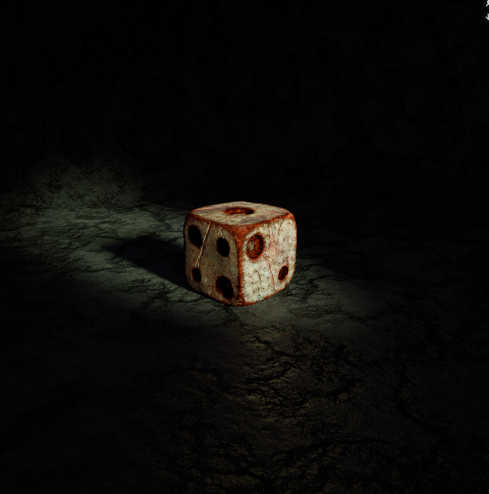

Blender YouTuber Smeaf is running a year-long challenge with different themes each month and three difficulty levels. February was all about texturing, so I decided to model some dice.

## Starting with the Basics

I wanted these dice to **look like they were carved from bone**—old, worn, and definitely not straight off a factory line. The first version was pretty clean: **sharp edges, crisp pips, and smooth materials**.

At this point, they looked fine, but they didn’t have much personality. They needed some **history**, some **wear and tear**, and maybe even a **bit of a backstory**.

---

## Adding Some Character

Once the base model was solid, I started making the dice feel **used and aged** by adding:

- 🎲 **Scratches and dents** to rough them up a little.
- 🛠️ **Roughness variation** so they weren’t perfectly smooth.
- 🔍 **Pip erosion** to make them look like they’d been handled a lot.

These little details made them feel like something that had been **rolled thousands of times** instead of something fresh out of a 3D printer.

---

## Making Them Tell a Story

At this point, I thought—why not take things a step further? So I added **blood stains** to hint at a darker history. Maybe these dice were part of some cursed game? Maybe they’ve seen a few things they’d rather forget?

To make the blood feel real, I made sure it **pooled inside the pips and soaked into the porous surface** rather than just sitting on top like a cheap paint job.

---

## Setting the Mood with Lighting

A great model needs the right **presentation**. I used:

- 🌫️ **Fog** for depth and atmosphere.
- 💡 **Strategic lighting** to emphasize textures.
- 🎭 **Ground texture** to reinforce the worn aesthetic.

Lighting was key—**a well-placed shadow or rim light did more for realism than material tweaks**.

---

## Final Touches

The last refinements brought everything together:

- 🎨 **Color balancing** to unify the scene.
- 🏁 **Final polish** for realism.
- 🎲 **Composition** to make the dice feel like part of a world.

This project wasn’t just about modeling—it was about **creating a story through design**. Every scratch, stain, and lighting choice contributed to the final look.

The best models don’t just look good; they feel like they belong. That’s the takeaway I’ll bring to my next project.
